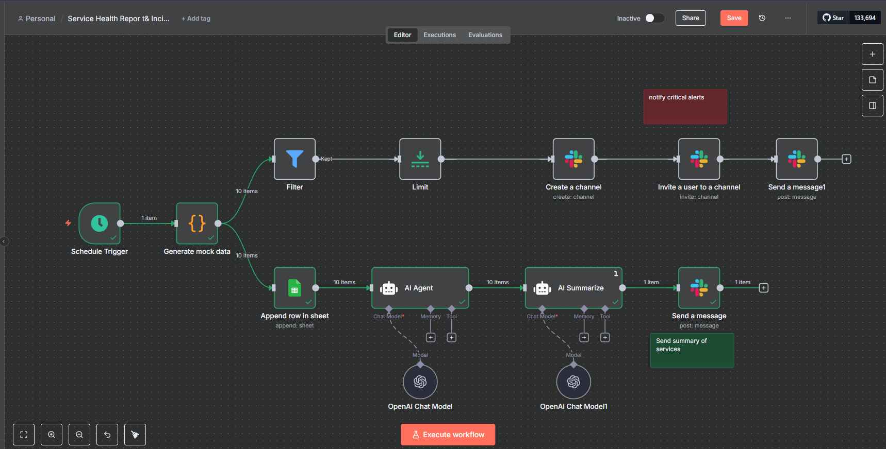
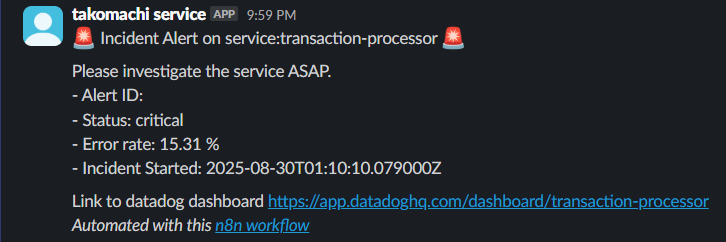
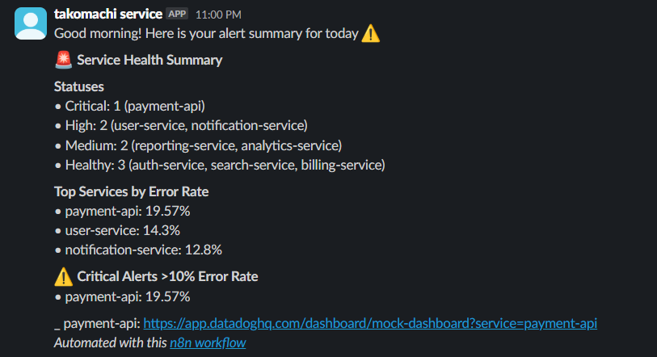
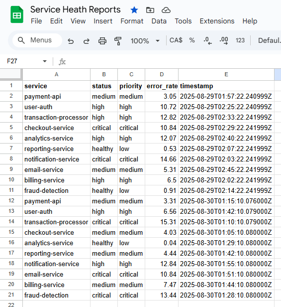

# Service Health Report & Incident Notification Workflow

This workflow is designed to monitor service health, generate alerts, and notify relevant stakeholders about incidents. It integrates with various tools such as OpenAI, Slack, and Google Sheets to provide a comprehensive observability solution.

## Workflow Overview

### Nodes
1. **Schedule Trigger**
   - Triggers the workflow daily at 8 AM.

2. **Generate Mock Data**
   - Generates mock service health data for testing purposes.
   - Each service report includes:
     - `service`: Service name.
     - `status`: Health status (`healthy`, `medium`, `high`, `critical`).
     - `priority`: Priority level based on status.
     - `error_rate`: Error rate percentage.`
     - `timestamp`: Timestamp of the report.

3. **Filter**
   - Filters critical alerts based on priority.

4. **Limit**
   - Limits the number of critical alerts processed.

5. **Create a Channel**
   - Creates a Slack channel for incident discussions.

6. **Invite a User to a Channel**
   - Invites a specific user to the created Slack channel.

7. **Send a Message**
   - Sends a summary of alerts to a Slack channel.

8. **Append Row in Sheet**
   - Appends service health data to a Google Sheet for record-keeping.

9. **AI Agent**
   - Uses OpenAI to summarize service health data.

10. **AI Summarize**
    - Generates a concise summary of service health and incidents.

### Connections
- The workflow connects nodes to ensure data flows seamlessly from generation to notification.

## Features
- **Mock Data Generation**: Simulates service health data for testing.
- **Critical Alert Filtering**: Identifies and processes critical alerts.
- **Slack Integration**: Notifies stakeholders via Slack channels.
- **Google Sheets Integration**: Logs service health data for historical analysis.
- **AI-Powered Summarization**: Uses OpenAI to generate concise summaries.

## Setup Instructions
1. **Configure Credentials**:
   - Add your OpenAI API key.
   - Add your Slack API credentials.
   - Add your Google Sheets OAuth credentials.

2. **Run the Workflow**:
   - Ensure the workflow is active.
   - The workflow will trigger automatically at the scheduled time.

3. **Customize**:
   - Modify the `Generate Mock Data` node to use real service data.
   - Update Slack channel IDs and user IDs as needed.

## Workflow Image

## Example Outputs
### Slack Notification & Google Sheets Data
1. Incident Alert Notification

2. Service Health Report

3 Google Sheet Data Upload 
